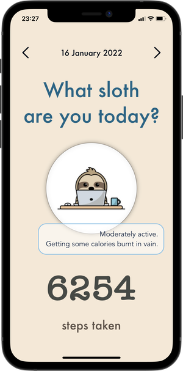

# SlothRateApp

The steps counting app for the real sloths.

## What does the app do?

This is a step tracker that gets the steps data from HealthKit and displays it accompanied by the funny pictures and descriptions that reveal your inner sloth.

## Preview

 

SwiftUI was used here for building GUI and brought me lots of joy along with lots of devastation while working with it :))

HealthKit dependencies are wrapped into protocols to ensure code's reusability and also to make functionality testing possible. The problem I've faced was that addressing to HealthKit throughout the code made it impossible to write unit tests that could check whether the steps data is retrieved correctly. That is why all HealthKit dependencied were wrapped into protocols thus I was able to create mock objects for unit testing.

## Running on simulator and real device

There's no need for any additional steps to run the app on simulator. You could add the steps count on built-in Health app and the app will work with this data.

Whilst to use the app on real device provisioning profile with HealthKit is required.

## Future directions:

1. Dates range analysis and comparison. 
2. Localizations. 
3. Accessibility.
